# Database design (Level 2)

MySQL / MariaDB, InnoDB, utf8mb4. Source of truth: `database/schema.sql` (structure) and `database/seed.sql` (game data).
26 tables: 25 for the game plus `schema_migrations`.

## 1. How the requested entities map to tables

I analysed the relationships before creating tables. Most entities became one table; four were merged, reshaped or added.

| Requested entity | Table(s) | Decision |
|---|---|---|
| Users | `users` | Login identity only (email, password hash, status). |
| Player profiles | `player_profiles` | 1:1 with users; `user_id` is the primary key. Cash, level, XP, in-game day. |
| Business types | `business_types` | Catalog. |
| Properties | `properties` | Catalog of lot **templates**. Every player has their own street, so players never fight over a lot. |
| Shops | `shops` | One lease on one lot plus the business running there. |
| Products | `products` | Catalog. Each product belongs to one business type. |
| Shop products + Inventory | `shop_products` | **Merged.** Both are 1:1 with (shop, product) and change together: price, stock and average cost live on one row. A separate table would only add a join. If batch or expiry tracking is needed later, add `inventory_batches` in a migration. |
| Transactions | `transactions` | Append-only money ledger. |
| Employees + Shop employees | `employees`, `shop_employees` | `employees` = hireable templates; `shop_employees` = hires with the agreed wage. |
| Upgrades + Shop upgrades | `upgrades`, `shop_upgrades` | Catalog + what a shop owns (with level). |
| Marketing campaigns | `marketing_campaigns`, **`shop_campaigns`** | Catalog plus a table for each run (a campaign can run many times). |
| Customers | **`shop_customers`** | **Reshaped.** Individual customers would be millions of rows nobody reads. The simulation works with segments, so this stores regulars, loyalty and satisfaction per shop and segment. |
| Customer segments | `customer_segments`, **`customer_segment_affinities`** | Segments plus a many-to-many table: how much each segment likes each business type. Needed for demand. |
| Events + Event effects | `events`, `event_effects`, **`player_events`** | One event changes several stats. `player_events` records which events hit which player and when. |
| Competitors | `competitors` | Designed characters (catalog). Per-player behavior is added when competition is built. |
| Achievements + User achievements | `achievements`, `user_achievements` | Catalog + unlocked rows. Progress is computed from live data, never stored twice. |
| Notifications | `notifications` | In-game inbox with a JSON payload. |
| AI advice | `ai_advice` | Advice text plus the JSON context the advisor was shown. |

## 2. ERD

```mermaid
erDiagram
  users ||--|| player_profiles : "1:1 game state"
  users ||--o{ shops : owns
  users ||--o{ transactions : "ledger"
  users ||--o{ notifications : receives
  users ||--o{ ai_advice : receives
  users ||--o{ player_events : "hit by"
  users ||--o{ user_achievements : unlocks

  properties ||--o{ shops : "leased as"
  business_types ||--o{ shops : "runs as"
  business_types ||--o{ products : sells
  business_types ||--o{ competitors : "rivals in"
  business_types |o--o{ employees : "specialist (NULL = any)"
  business_types |o--o{ upgrades : "specific (NULL = all)"
  business_types ||--o{ customer_segment_affinities : "liked by"

  shops ||--o{ shop_products : "price + stock"
  products ||--o{ shop_products : "listed in"
  shops ||--o{ shop_employees : hires
  employees ||--o{ shop_employees : "hired as"
  shops ||--o{ shop_upgrades : owns
  upgrades ||--o{ shop_upgrades : "bought as"
  shops ||--o{ shop_campaigns : runs
  marketing_campaigns ||--o{ shop_campaigns : "run as"
  shops ||--o{ shop_customers : "customer base"
  customer_segments ||--o{ shop_customers : "segment of"
  shops |o--o{ transactions : "money for (NULL = player level)"
  products |o--o{ transactions : "item of"
  shops |o--o{ ai_advice : "about"

  customer_segments ||--o{ customer_segment_affinities : likes
  customer_segments |o--o{ marketing_campaigns : "targeted by"
  events ||--o{ event_effects : changes
  events ||--o{ player_events : "occurs as"
  achievements ||--o{ user_achievements : "unlocked as"
```



Reading the diagram by area:

```
ACCOUNT        users 1──1 player_profiles
WORLD (catalog, filled by seed.sql, read-only in play)
               business_types ─┬─ products
                               ├─ competitors
                               ├─ employees*   upgrades*   (* optional link: NULL = any type)
                               └─ customer_segment_affinities ─ customer_segments ─ marketing_campaigns*
               properties        events ─ event_effects        achievements
PLAYER STATE   users ─ shops ─┬─ shop_products  (price + stock) ─ products
                              ├─ shop_employees ─ employees
                              ├─ shop_upgrades  ─ upgrades
                              ├─ shop_campaigns ─ marketing_campaigns
                              └─ shop_customers ─ customer_segments
               users ─ transactions (ledger) · notifications · ai_advice · player_events · user_achievements
```

## 3. Design rules and why

**Money is integer cents** (`*_cents`, BIGINT or INT). Integer math is exact, so totals always add up. The API sends cents; the frontend formats them (`formatCurrency(cents / 100)`).

**One owner key.** Every player table has `user_id` referencing `users.id`. Child tables (`shop_*`) reach the owner through `shops`, so ownership is stored once.

**Snapshots where an agreement is made.** `shops.rent_per_day_cents`, `shop_employees.wage_per_day_cents` and `shop_campaigns.cost_cents` copy the price at signing time. Later catalog changes or events never rewrite what the player already agreed to. This is the only intentional duplication.

**The database enforces the rules a bug could break:**

| Rule | Mechanism |
|---|---|
| Cash never negative | `CHECK (cash_cents >= 0)` |
| Stock never negative | `stock_quantity` is `UNSIGNED`; overselling raises "out of range" in strict mode |
| A player holds each lot once at a time, but may rent it again after closing | Generated column `shops.active_property_id` (NULL when closed) + `UNIQUE (user_id, active_property_id)` |
| A product is listed once per shop; a hire exists once per shop; an upgrade once per shop | Composite primary keys |
| A ledger row cannot point at another player's shop | Composite FK `(shop_id, user_id) -> shops (id, user_id)`; same for `ai_advice` |
| Catalog rows in use cannot be deleted | FKs to catalog tables are `RESTRICT` |
| Deleting a user removes all their data | FKs from player tables are `ON DELETE CASCADE` |
| Ledger entries are meaningful | `CHECK (amount_cents <> 0)`; `balance_after_cents` recorded on every row |

`CHECK` constraints are enforced by MySQL 8.0.16+ and MariaDB 10.2+ (older MySQL parses and ignores them).

**Rules the database cannot express** (they involve another table), so the service layer must enforce them: a shop only stocks products of its own business type; upgrade `level <= max_level`; employee count `<= base_staff_slots + staff-slot upgrades`; `min_player_level` requirements.

## 4. Writing gameplay code safely

1. Wrap every state change in `Database::transaction(fn () => ...)`. It commits on success, rolls back on any exception, supports nesting (savepoints) and retries on deadlock.
2. Lock before you read-then-write: `SELECT cash_cents FROM player_profiles WHERE user_id = ? FOR UPDATE`, check funds, then update.
3. A cash change = update `player_profiles.cash_cents` **and** insert a `transactions` row in the same transaction. Never edit or delete ledger rows; correct mistakes with a new row (`type = 'refund'`).
4. Update stock with relative SQL (`stock_quantity = stock_quantity - ?`), not read-modify-write in PHP.
5. Use integers for money. If a percentage is applied, round once, at the end, with `intdiv` or `round()`, and record the rounded amount.
6. Map `DatabaseException` helpers to HTTP errors: `isDuplicateKey()` -> 409, `isForeignKeyViolation()` -> 422/409, `isOutOfRange()` -> "not enough stock".

Reports (daily revenue and profit per shop) are computed from `transactions` using the `(shop_id, game_day, type)` and `(user_id, game_day)` indexes. If that ever gets slow, add a daily roll-up table in a migration.

## 5. Operating the database

```bash
php database/migrate.php            # create the database, apply schema.sql and pending migrations
php database/migrate.php --seed     # ...and load seed.sql (repeatable; refreshes catalog rows)
php database/migrate.php --fresh    # development only: drop all tables, rebuild (refused when APP_ENV=production)
php tests/run.php                   # database, schema, seed, transaction, constraint and router checks
php tests/run.php --base-url=http://localhost:8000   # ...plus live API checks
```

- `DB_NAME` in `.env` is the only place the database name is set. `migrate.php` creates it; `schema.sql` no longer contains `CREATE DATABASE`/`USE`. If you load `schema.sql` by hand, select the database first.
- `schema.sql` is a baseline: it only creates missing tables. After the first release, every structure change goes into a numbered file in `database/migrations/` (`001_add_x.sql`), which `migrate.php` records in `schema_migrations`. During development, `--fresh` is simpler.
- `seed.sql` is keyed by slug/code (`ON DUPLICATE KEY UPDATE`), so re-running it updates the catalog without duplicates or id changes. It holds rules only: **no player accounts**.
- Production: do not use `root`. Create a user limited to the game database:

```sql
CREATE USER 'startup'@'localhost' IDENTIFIED BY 'a-long-random-password';
GRANT ALL PRIVILEGES ON startup_street.* TO 'startup'@'localhost';
```

  Credentials live only in `.env` (git-ignored, blocked by `router.php`, never sent to the browser). The health endpoint reports only `connected: true/false`; the driver's message is added only when `APP_DEBUG=true`.

## 6. Tables at a glance

| Table | Kind | Key | Notable constraints |
|---|---|---|---|
| `users` | account | `id` | unique `email`, `username` |
| `player_profiles` | player | `user_id` | cash >= 0, level >= 1 |
| `business_types` | catalog | `id`, unique `slug` | |
| `properties` | catalog | `id`, unique `code`, unique `street_slot` | foot_traffic <= 100 |
| `products` | catalog | `id`, unique `slug` | price >= cost |
| `customer_segments` | catalog | `id`, unique `slug` | shares sum to 100 (seed-checked) |
| `customer_segment_affinities` | catalog | (`segment_id`, `business_type_id`) | |
| `employees` | catalog | `id`, unique `code` | |
| `upgrades` | catalog | `id`, unique `code` | `effect_type` enum |
| `marketing_campaigns` | catalog | `id`, unique `code` | |
| `events` / `event_effects` | catalog | `id` | effects cascade with their event |
| `competitors` | catalog | `id`, unique `slug` | |
| `achievements` | catalog | `id`, unique `code` | |
| `shops` | player | `id` | one open shop per (user, lot); unique (`id`, `user_id`) |
| `shop_products` | player | (`shop_id`, `product_id`) | stock UNSIGNED |
| `shop_employees` | player | (`shop_id`, `employee_id`) | |
| `shop_upgrades` | player | (`shop_id`, `upgrade_id`) | level >= 1 |
| `shop_campaigns` | player | `id` | end_day >= start_day |
| `shop_customers` | player | (`shop_id`, `segment_id`) | |
| `player_events` | player | `id` | end_day >= start_day |
| `user_achievements` | player | (`user_id`, `achievement_id`) | |
| `transactions` | ledger | `id` (BIGINT) | amount <> 0; composite owner FK |
| `notifications` | player | `id` (BIGINT) | JSON `data` |
| `ai_advice` | player | `id` (BIGINT) | JSON `context`; composite owner FK |
| `schema_migrations` | system | `id`, unique `filename` | |
